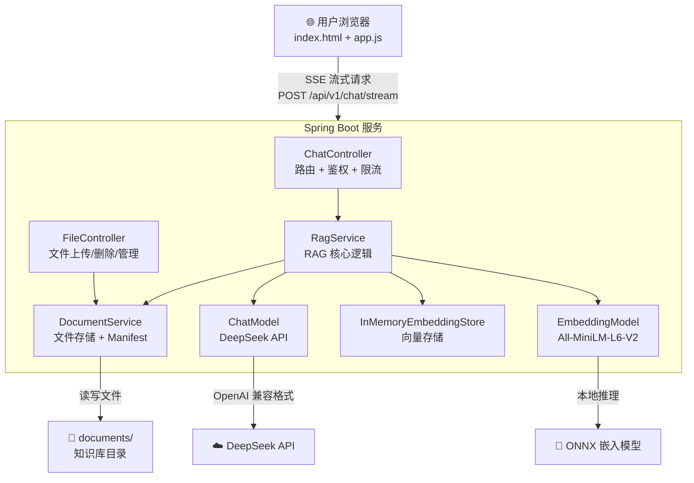
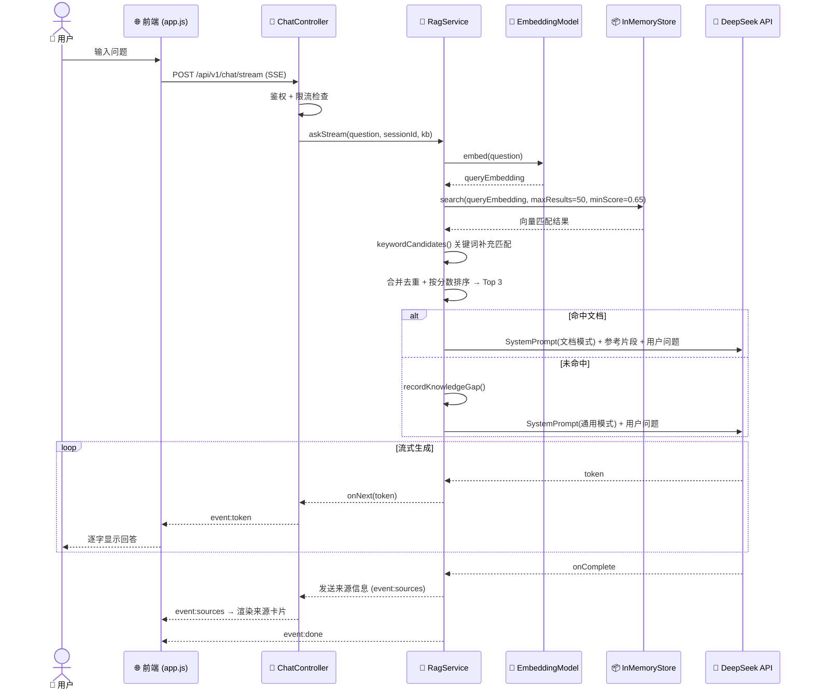

# DocuMind - 智能文档 RAG 助手

[](https://openjdk.org/projects/jdk/17/)
[](https://spring.io/projects/spring-boot)
[](https://github.com/langchain4j/langchain4j)
[](LICENSE)

DocuMind 是一款基于 Java Spring Boot 和 LangChain4j 构建的智能文档检索助手。它利用检索增强生成 (RAG) 技术，能够针对用户上传的文档提供精准的解读和问答，并在文档库未命中时自动切换至通用的 AI 知识库。

## 🏗️ 系统架构



**组件说明**：
- **前端**：原生 HTML5/JS/CSS 单页应用，通过 SSE 实现流式回答展示
- **RagService**：混合检索（向量相似度 + 关键词匹配）、会话记忆、分块策略
- **InMemoryEmbeddingStore**：进程内向量库，定期序列化到 `.documind-vectors.json`
- **DocumentService**：文件系统存储 + JPA 元数据管理，默认 H2，PostgreSQL profile 支持 Flyway 迁移验证

## 🔄 RAG 工作流程



## ✨ 核心特性

- **现代感 UI 界面**：采用暗黑磨砂玻璃风格设计，提供流畅的交互体验。
- **智能 RAG 检索**：通过向量相似度计算，精准锁定文档相关内容。
- **参考来源**：命中文档时返回文件名、片段编号、相似度和文本摘录，便于核实答案。
- **基础访问控制**：使用 Spring Security Basic Auth 保护页面和 API，文档管理仅管理员可用。
- **知识库空间**：支持按知识库上传和提问，不同知识库的检索结果互相隔离。
- **索引状态**：文档列表显示待索引、索引中、已索引、索引失败和片段数。
- **基础混合检索**：结合向量相似度和关键词匹配，减少编号、术语、流程名漏检。
- **知识缺口记录**：当前知识库没有命中文档时，自动记录用户问题，方便后续补文档。
- **文档过期提示**：按上传时间标记可能过期文档，默认阈值为 180 天。
- **负责人追踪**：上传文档时记录上传人和负责人，未命中时可提示联系负责人补充资料。
- **FAQ 草稿**：管理员可根据知识缺口生成 Markdown FAQ 草稿。
- **文件 Hash 去重**：基于 SHA-256 计算文件哈希，同知识库下相同内容的文件不允许重复上传。
- **检索调试视图**：启用 Debug 模式后，展示所有候选片段的得分、匹配类型（向量/关键词/混合）、是否被采用，便于排查 RAG 召回质量。
- **分流机制 (Hybrid AI)**：
  - **精准命中**：若文档中存在相关信息，AI 将基于本地知识进行深度解读。
  - **通用回退**：若文档未提及，AI 将明确说明未命中文档，再利用通用知识提供谨慎建议。
- **多轮对话记忆**：支持上下文理解，让沟通更自然、更连贯。
- **文件管理**：支持 PDF、Word、Excel、PPT、TXT 格式文档的快速上传、解析及索引构建。

## 🛠️ 技术栈

- **后端**: Java 17, Spring Boot 3.4.5
- **AI 框架**: [LangChain4j](https://github.com/langchain4j/langchain4j) 1.16.3
- **嵌入模型**: All-MiniLM-L6-V2 (本地运行)
- **大语言模型**: DeepSeek API (兼容 OpenAI 格式)
- **前端**: 原生 HTML5, Vanilla JS, CSS3 (针对现代浏览器优化)
- **数据库**: H2（默认本地/单实例）+ PostgreSQL profile（Flyway schema 迁移验证）

## 🚀 快速启动

### 前置条件

- JDK 17+
- Maven 3.8+
- [DeepSeek API Key](https://platform.deepseek.com/)

### 启动步骤

**Step 1 — 克隆项目**

```bash
git clone https://github.com/your-org/DocuMind.git
cd DocuMind
```

**Step 2 — 配置环境变量**

> **重要：请勿将 API Key 直接写入配置文件！**

```bash
# 必填
export DEEPSEEK_API_KEY="<deepseek-api-key-from-secret-store>"
export DOCUMIND_ADMIN_PASSWORD="<admin-password-from-secret-store>"

# 可选（以下为默认值）
export DEEPSEEK_TIMEOUT_SECONDS=60
export DOCUMIND_MIN_PASSWORD_LENGTH=12
export DOCUMIND_STALE_DAYS=180
export DOCUMIND_MAX_FILE_SIZE=50MB
```

也可以使用配置文件方式：
```bash
cp src/main/resources/application-local.yml.template src/main/resources/application-local.yml
# 编辑 application-local.yml，并用 -Dspring.profiles.active=local 启用
```

默认管理员用户名为 `admin`，可通过 `DOCUMIND_ADMIN_USERNAME` 修改。也可以配置只允许提问的普通账号：

```bash
export DOCUMIND_USER_USERNAME=user
export DOCUMIND_USER_PASSWORD="<reader-password-from-secret-store>"
export DOCUMIND_USER_KNOWLEDGE_BASES=default
```

详细配置说明请参考 [SECURITY.md](./SECURITY.md)，服务器部署请参考 [DEPLOYMENT.md](./docs/DEPLOYMENT.md)。

**Step 3 — 启动应用**

```bash
export JAVA_HOME=$(/usr/libexec/java_home -v 17)
mvn spring-boot:run
```

**Step 4 — 打开浏览器**

访问 `http://localhost:8080`，使用管理员账号登录。

**Step 5 — 开始使用**

1. 点击侧边栏「文档管理」，上传 PDF/Word/Excel/PPT/TXT 文档
2. 等待文档索引完成（状态变为「已索引 · N 片段」）
3. 在聊天框输入问题，AI 将基于文档内容回答并附上参考来源

## 💬 示例问答

### 示例 1：命中文档的精准回答

> **用户**：公司的年假政策是怎样的？
>
> **DocuMind**：根据《员工手册 2024.pdf》，公司年假政策如下：
>
> - 工作满 1 年不满 10 年：**5 天** 带薪年假
> - 工作满 10 年不满 20 年：**10 天** 带薪年假
> - 工作满 20 年以上：**15 天** 带薪年假
>
> 年假可在当年内分次使用，未休完的年假不可跨年累积 [1]。
>
> **参考来源**：
> [1] default/员工手册 2024.pdf，片段：default/员工手册 2024.pdf#12，相似度：0.876
> 摘录：第三章 薪酬与福利 → 年假制度：员工入职满一年后可享受带薪年假...

### 示例 2：未命中文档的通用回退

> **用户**：量子计算的发展趋势是什么？
>
> **DocuMind**：文档中未找到与「量子计算」相关的信息。以下是基于通用知识的简要介绍：
>
> 量子计算是利用量子力学原理进行信息处理的技术。近年来主要发展趋势包括...
>
> *建议联系知识库负责人补充相关资料。*

### 示例 3：知识缺口记录

当用户多次提问某领域但文档未覆盖时，系统自动记录为「知识缺口」，管理员可在文档管理面板查看并据此补充文档。

## 📂 项目结构

```text
DocuMind/
├── src/main/java/com/documind/
│   ├── controller/          # ChatController, FileController, Admin*Controller 等
│   ├── service/             # RagService, DocumentService, AuditService 等
│   ├── config/              # LangChain, Security, CORS, OpenAPI, TraceId 配置
│   ├── repository/          # Spring Data JPA Repository
│   ├── model/               # JPA Entity 和 Converter
│   ├── dto/                 # 请求/响应 DTO
│   └── exception/           # 全局异常处理
├── src/main/resources/
│   ├── db/migration/        # PostgreSQL Flyway migration
│   ├── prompts/             # RAG prompt 模板
│   ├── static/              # 前端 (index.html, admin.html, JS/CSS)
│   ├── application.yml      # 公共配置
│   ├── application-dev.yml.template # 本地 H2 开发 profile 模板
│   ├── application-prod.yml # H2 单实例生产 profile
│   └── application-postgres.yml # PostgreSQL/Flyway 验证 profile
├── docs/                    # 部署、RAG 评测、工程成熟度和简历说明
├── docker-compose.postgres.yml
├── documents/               # 本地上传文档和索引文件目录
└── pom.xml                  # Maven 依赖
```

真实的 `application-dev.yml` / `application-local.yml` 是本机私有配置，已被 Git、Docker build context 和 Maven resources 排除，不会进入发布 JAR。

## 知识库和索引

- 默认知识库使用 `documents/` 根目录，新增知识库使用 `documents/<知识库名>/` 子目录。
- 文档元数据、索引状态、知识缺口和审计记录默认保存在 H2 中；PostgreSQL profile 使用 Flyway 管理关系型 schema。
- 旧版本的 `.documind-files.json`、`.documind-gaps.json` 和 `.documind-audit.log` 会在启动时迁移。
- 文档过期提示按 `DOCUMIND_STALE_DAYS` 判断；默认 180 天。
- 向量库运行时仍使用内存实现，同时会持久化到 `.documind-vectors.json`；服务重启后优先加载快照，并按文件变化增量刷新。
- 运行过程中刷新索引会复用已成功索引且未变化文件的解析和嵌入结果，只处理新增或更新文件。
- RAG 检索参数可通过 `DOCUMIND_RAG_MAX_RESULTS`、`DOCUMIND_RAG_MIN_SCORE`、`DOCUMIND_RAG_KEYWORD_MIN_HIT_RATIO`、`DOCUMIND_RAG_RETRIEVAL_POOL_SIZE`、`DOCUMIND_RAG_CHUNK_SIZE`、`DOCUMIND_RAG_CHUNK_OVERLAP` 调整。
- 真实答案质量建议按 [RAG_EVALUATION.md](./docs/RAG_EVALUATION.md) 的问题集定期检查，当前评测说明见 [RAG_EVALUATION_REPORT.md](./docs/RAG_EVALUATION_REPORT.md)。
- 服务器部署、CloudBase Run 容器部署准备、备份、健康检查和升级流程见 [DEPLOYMENT.md](./docs/DEPLOYMENT.md)。

## 测试

```bash
export JAVA_HOME=$(/usr/libexec/java_home -v 17)
mvn test
```

当前默认测试基线：`mvn test` 通过 107 个测试，覆盖文档存储、RAG 检索、流式问答、权限、审计、限流、健康检查、用户管理、知识库管理、前端 API/SSE 工具函数和 RAG 自动化评测。默认测试不调用真实 DeepSeek API。

前端模块测试：

```bash
npm run test:frontend
```

PostgreSQL/Flyway 集成验证需先启动本机 Docker PostgreSQL：

```bash
docker compose -f docker-compose.postgres.yml up -d
SPRING_PROFILES_ACTIVE=postgres mvn -B -Dtest=PostgresIntegrationIT test
docker compose -f docker-compose.postgres.yml down -v
```

PostgreSQL 测试会验证 Flyway 从空库初始化 schema，并覆盖账号、文档元数据、知识缺口、审计和知识库权限路径。

## HTTP 接口

### 问答接口

| 方法 | 路径 | 说明 | 权限 |
|------|------|------|------|
| `POST` | `/api/v1/chat` | 普通问答 | 登录用户 |
| `POST` | `/api/v1/chat/stream` | 流式问答（SSE） | 登录用户 |
| `DELETE` | `/api/v1/chat/sessions/{sessionId}` | 清理会话记忆 | 登录用户 |

**问答参数**：`message`（最长 5000 字符）、`sessionId`（最长 100 字符）、`knowledgeBase`（最长 60 字符）、`debug`（可选，启用检索调试信息）。

### 文件管理接口

| 方法 | 路径 | 说明 | 权限 |
|------|------|------|------|
| `POST` | `/api/v1/files/upload` | 上传文档（form-data: `file`, `knowledgeBase`, `owner`） | 管理员 |
| `DELETE` | `/api/v1/files/{filename}?knowledgeBase=X` | 删除文档 | 管理员 |
| `GET` | `/api/v1/files/list?knowledgeBase=X` | 列出文档和索引状态 | 管理员 |
| `GET` | `/api/v1/files/{filename}/download?knowledgeBase=X` | 下载原始文档 | 管理员 |
| `POST` | `/api/v1/files/refresh` | 重建全量索引 | 管理员 |
| `GET` | `/api/v1/files/knowledge-bases` | 列出可访问的知识库 | 登录用户 |
| `GET` | `/api/v1/files/status` | 每个知识库的统计信息 | 管理员 |

### 后台用户管理接口

| 方法 | 路径 | 说明 | 权限 |
|------|------|------|------|
| `GET` | `/api/v1/admin/users` | 用户列表，不返回密码 | 管理员 |
| `POST` | `/api/v1/admin/users` | 新建用户 | 管理员 |
| `PUT` | `/api/v1/admin/users/{id}` | 更新角色、启用状态和知识库权限 | 管理员 |
| `PUT` | `/api/v1/admin/users/{id}/password` | 重置密码 | 管理员 |

### 知识缺口与 FAQ 接口

| 方法 | 路径 | 说明 | 权限 |
|------|------|------|------|
| `GET` | `/api/v1/files/gaps?knowledgeBase=X` | 查看知识缺口 | 管理员 |
| `DELETE` | `/api/v1/files/gaps/{gapId}?knowledgeBase=X` | 标记缺口为已处理 | 管理员 |
| `GET` | `/api/v1/files/faq-draft?knowledgeBase=X` | 生成 FAQ Markdown 草稿 | 管理员 |
| `GET` | `/api/v1/files/audit?limit=100` | 查看审计记录 | 管理员 |

### 健康检查接口

| 方法 | 路径 | 说明 | 权限 |
|------|------|------|------|
| `GET` | `/api/v1/health` | 存活检查 | 公开 |
| `GET` | `/api/v1/health/readiness` | Readiness 检查（含配置、索引状态） | 管理员 |

审计记录写入数据库。当前记录问答、限流问答、清理会话记忆、上传、下载、删除、刷新索引、生成 FAQ 草稿、处理知识缺口、创建用户、更新用户和重置密码等操作；问答审计只保存账号、知识库、会话 ID、问题长度和是否流式请求，不保存完整问题正文。默认保留最近 10000 条记录，可用 `DOCUMIND_AUDIT_MAX_EVENTS` 调整。

聊天请求限制：`message` 最长 5000 字符；`sessionId` 最长 100 字符，只允许字母、数字、点、下划线、冒号和连字符；`knowledgeBase` 最长 60 字符，只允许文字、数字、点、下划线和连字符。

问答频率限制：默认每个账号每分钟 30 次，可通过 `DOCUMIND_CHAT_RATE_LIMIT_PER_MINUTE` 调整；设置为 `0` 表示关闭。

流式问答使用独立线程池，默认常驻线程 4、最大线程 8、队列 100，可通过 `DOCUMIND_CHAT_STREAM_CORE_POOL_SIZE`、`DOCUMIND_CHAT_STREAM_MAX_POOL_SIZE`、`DOCUMIND_CHAT_STREAM_QUEUE_CAPACITY` 调整。

超时配置：DeepSeek 调用默认 60 秒，可用 `DEEPSEEK_TIMEOUT_SECONDS` 调整；流式问答 SSE 连接默认 120 秒，可用 `DOCUMIND_CHAT_STREAM_TIMEOUT_SECONDS` 调整。

## 环境变量参考

### 必填变量

| 变量名 | 说明 | 示例 |
|--------|------|------|
| `DEEPSEEK_API_KEY` | DeepSeek API 密钥 | 由环境变量或密钥管理器注入 |
| `DOCUMIND_ADMIN_PASSWORD` | 管理员密码（≥12 字符） | 由环境变量或密钥管理器注入 |

### 可选变量

| 变量名 | 默认值 | 说明 |
|--------|--------|------|
| `DOCUMIND_ADMIN_USERNAME` | `admin` | 管理员用户名 |
| `DOCUMIND_USER_USERNAME` | - | 普通用户名 |
| `DOCUMIND_USER_PASSWORD` | - | 普通用户密码 |
| `DOCUMIND_USER_KNOWLEDGE_BASES` | `default` | 普通用户可访问的知识库 |
| `DOCUMIND_MIN_PASSWORD_LENGTH` | `12` | 最小密码长度 |
| `DEEPSEEK_BASE_URL` | `https://api.deepseek.com` | DeepSeek API 地址 |
| `DEEPSEEK_MODEL` | `deepseek-v4-flash` | 使用的模型 |
| `DEEPSEEK_TIMEOUT_SECONDS` | `60` | API 调用超时（秒） |
| `DOCUMIND_MAX_FILE_SIZE` | `50MB` | 单文件大小上限 |
| `DOCUMIND_STALE_DAYS` | `180` | 文档过期天数阈值 |
| `DOCUMIND_DB_PATH` | `${user.dir}/documents/.documind-db` | H2 文件数据库路径 |
| `DOCUMIND_DB_URL` | - | PostgreSQL profile JDBC URL，启用 `postgres` profile 时必填 |
| `DOCUMIND_DB_USERNAME` | `sa` / `documind` | H2 或 PostgreSQL 数据库用户名 |
| `DOCUMIND_DB_PASSWORD` | - | H2 或 PostgreSQL 数据库密码，启用 `postgres` profile 时必填 |
| `DOCUMIND_JPA_DDL_AUTO` | `update` | H2 表结构处理方式，生产环境可改为 `validate` |
| `SPRING_PROFILES_ACTIVE` | `dev` | 运行 profile，生产环境设置为 `prod` |
| `PORT` | `8080` | HTTP 监听端口，CloudBase Run 等容器平台可注入 |
| `DOCUMIND_RAG_MAX_RESULTS` | `3` | 检索返回的最大片段数 |
| `DOCUMIND_RAG_MIN_SCORE` | `0.65` | 向量检索最低相似度阈值 |
| `DOCUMIND_RAG_KEYWORD_MIN_HIT_RATIO` | `0.25` | 关键词匹配最低命中率 |
| `DOCUMIND_RAG_RETRIEVAL_POOL_SIZE` | `50` | 向量检索候选池大小 |
| `DOCUMIND_RAG_CHUNK_SIZE` | `500` | 文档切分片段大小（token） |
| `DOCUMIND_RAG_CHUNK_OVERLAP` | `50` | 相邻片段重叠大小（token） |
| `DOCUMIND_CHAT_RATE_LIMIT_PER_MINUTE` | `30` | 每账号每分钟问答次数限制 |
| `DOCUMIND_CHAT_STREAM_TIMEOUT_SECONDS` | `120` | SSE 连接超时（秒） |
| `DOCUMIND_CHAT_STREAM_CORE_POOL_SIZE` | `4` | 流式线程池核心线程数 |
| `DOCUMIND_CHAT_STREAM_MAX_POOL_SIZE` | `8` | 流式线程池最大线程数 |
| `DOCUMIND_AUDIT_MAX_EVENTS` | `10000` | 审计日志最大记录数 |

## 📝 许可证
MIT License
