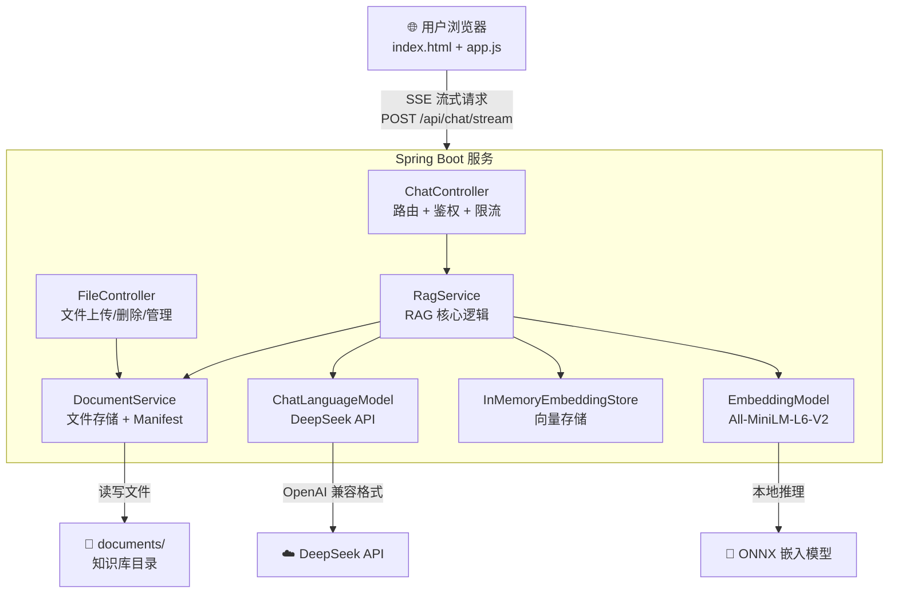
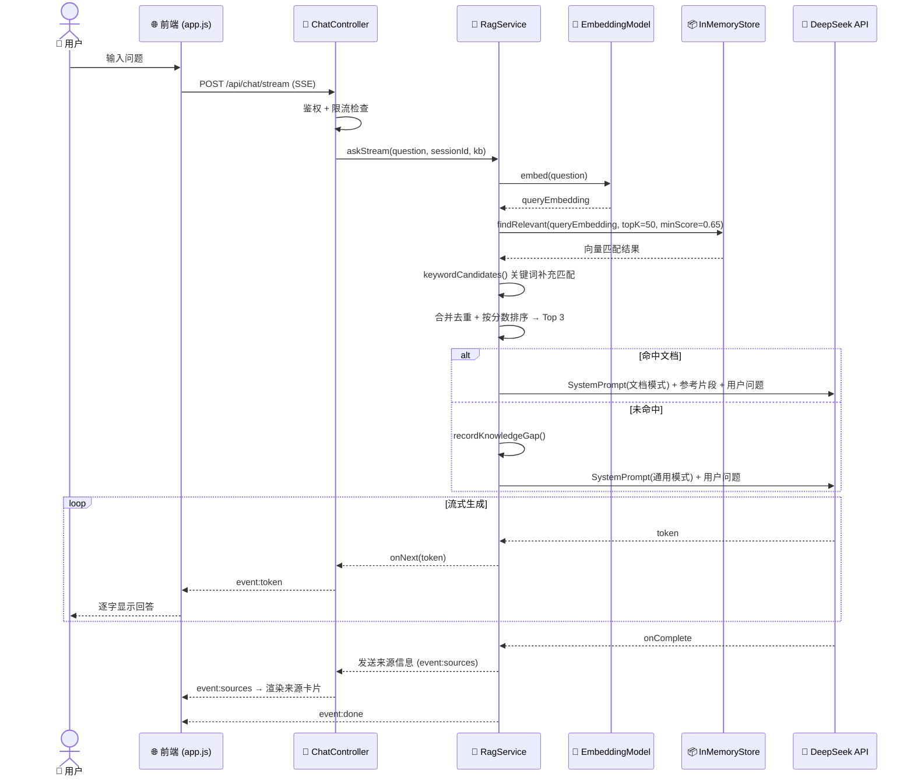

# DocuMind - 智能文档 RAG 助手

DocuMind 是一款基于 Java Spring Boot 和 LangChain4j 构建的智能文档检索助手。它利用检索增强生成 (RAG) 技术，能够针对用户上传的文档提供精准的解读和问答，并在文档库未命中时自动切换至通用的 AI 知识库。

<!--  -->
<!-- TODO: 补充实际截图 -->

## 🏗️ 系统架构



**组件说明**：
- **前端**：原生 HTML5/JS/CSS 单页应用，通过 SSE 实现流式回答展示
- **RagService**：混合检索（向量相似度 + 关键词匹配）、会话记忆、分块策略
- **InMemoryEmbeddingStore**：进程内向量库，服务重启后从文件重建索引
- **DocumentService**：文件系统存储 + `.documind-files.json` 清单管理

## 🔄 RAG 工作流程



## ✨ 核心特性

- **现代感 UI 界面**：采用暗黑磨砂玻璃风格设计，提供流畅的交互体验。
- **智能 RAG 检索**：通过向量相似度计算，精准锁定文档相关内容。
- **参考来源**：命中文档时返回文件名、片段编号、相似度和文本摘录，便于核实答案。
- **基础访问控制**：使用 Spring Security Basic Auth 保护页面和 API，文档管理仅管理员可用。
- **知识库空间**：支持按知识库上传和提问，不同知识库的检索结果互相隔离。
- **索引状态**：文档列表显示待索引、索引中、已索引、索引失败和片段数。
- **基础混合检索**：结合向量相似度和关键词匹配，减少编号、术语、流程名漏检。
- **知识缺口记录**：当前知识库没有命中文档时，自动记录用户问题，方便后续补文档。
- **文档过期提示**：按上传时间标记可能过期文档，默认阈值为 180 天。
- **负责人追踪**：上传文档时记录上传人和负责人，未命中时可提示联系负责人补充资料。
- **FAQ 草稿**：管理员可根据知识缺口生成 Markdown FAQ 草稿。
- **分流机制 (Hybrid AI)**：
  - **精准命中**：若文档中存在相关信息，AI 将基于本地知识进行深度解读。
  - **通用回退**：若文档未提及，AI 将明确说明未命中文档，再利用通用知识提供谨慎建议。
- **多轮对话记忆**：支持上下文理解，让沟通更自然、更连贯。
- **文件管理**：支持 PDF、Word、Excel、PPT、TXT 格式文档的快速上传、解析及索引构建。

## 🛠️ 技术栈

- **后端**: Java 17, Spring Boot 3.2.1
- **AI 框架**: [LangChain4j](https://github.com/langchain4j/langchain4j)
- **嵌入模型**: All-MiniLM-L6-V2 (本地运行)
- **大语言模型**: DeepSeek API (兼容 OpenAI 格式)
- **前端**: 原生 HTML5, Vanilla JS, CSS3 (针对现代浏览器优化)

## 🚀 快速启动

### 前置条件

- JDK 17+
- Maven 3.8+
- [DeepSeek API Key](https://platform.deepseek.com/)

### 启动步骤

**Step 1 — 克隆项目**

```bash
git clone https://github.com/your-org/DocuMind.git
cd DocuMind
```

**Step 2 — 配置环境变量**

> **重要：请勿将 API Key 直接写入配置文件！**

```bash
# 必填
export DEEPSEEK_API_KEY=your_actual_api_key_here
export DOCUMIND_ADMIN_PASSWORD=your_secure_password

# 可选（以下为默认值）
export DEEPSEEK_TIMEOUT_SECONDS=60
export DOCUMIND_MIN_PASSWORD_LENGTH=12
export DOCUMIND_STALE_DAYS=180
export DOCUMIND_MAX_FILE_SIZE=50MB
```

也可以使用配置文件方式：
```bash
cp src/main/resources/application-local.yml.template src/main/resources/application-local.yml
# 编辑 application-local.yml，填入 API Key 和管理员密码
```

默认管理员用户名为 `admin`，可通过 `DOCUMIND_ADMIN_USERNAME` 修改。也可以配置只允许提问的普通账号：

```bash
export DOCUMIND_USER_USERNAME=user
export DOCUMIND_USER_PASSWORD=user_password
export DOCUMIND_USER_KNOWLEDGE_BASES=default
```

详细配置说明请参考 [SECURITY.md](./SECURITY.md)，服务器部署请参考 [DEPLOYMENT.md](./docs/DEPLOYMENT.md)。

**Step 3 — 启动应用**

```bash
export JAVA_HOME=$(/usr/libexec/java_home -v 17)
mvn spring-boot:run
```

**Step 4 — 打开浏览器**

访问 `http://localhost:8080`，使用管理员账号登录。

**Step 5 — 开始使用**

1. 点击侧边栏「文档管理」，上传 PDF/Word/Excel/PPT/TXT 文档
2. 等待文档索引完成（状态变为「已索引 · N 片段」）
3. 在聊天框输入问题，AI 将基于文档内容回答并附上参考来源

## 💬 示例问答

### 示例 1：命中文档的精准回答

> **用户**：公司的年假政策是怎样的？
>
> **DocuMind**：根据《员工手册 2024.pdf》，公司年假政策如下：
>
> - 工作满 1 年不满 10 年：**5 天** 带薪年假
> - 工作满 10 年不满 20 年：**10 天** 带薪年假
> - 工作满 20 年以上：**15 天** 带薪年假
>
> 年假可在当年内分次使用，未休完的年假不可跨年累积 [1]。
>
> **参考来源**：
> [1] default/员工手册 2024.pdf，片段：default/员工手册 2024.pdf#12，相似度：0.876
> 摘录：第三章 薪酬与福利 → 年假制度：员工入职满一年后可享受带薪年假...

### 示例 2：未命中文档的通用回退

> **用户**：量子计算的发展趋势是什么？
>
> **DocuMind**：文档中未找到与「量子计算」相关的信息。以下是基于通用知识的简要介绍：
>
> 量子计算是利用量子力学原理进行信息处理的技术。近年来主要发展趋势包括...
>
> *建议联系知识库负责人补充相关资料。*

### 示例 3：知识缺口记录

当用户多次提问某领域但文档未覆盖时，系统自动记录为「知识缺口」，管理员可在文档管理面板查看并据此补充文档。

## 📂 项目结构

```text
DocuMind/
├── src/main/java/com/demo/ragchat/
│   ├── controller/          # ChatController, FileController, HealthController
│   ├── service/             # RagService, DocumentService, AuditService 等
│   ├── config/              # LangChain, Security, CORS 配置
│   ├── dto/                 # 请求/响应 DTO
│   └── exception/           # 全局异常处理
├── src/main/resources/
│   ├── static/              # 前端 (index.html, app.js, style.css)
│   └── application.yml      # 应用配置
├── documents/               # 上传文档存储目录
└── pom.xml                  # Maven 依赖
```

## 知识库和索引

- 默认知识库使用 `documents/` 根目录，新增知识库使用 `documents/<知识库名>/` 子目录。
- 每个知识库目录会生成 `.documind-files.json`，记录文件大小、上传时间、索引状态、片段数和错误信息。
- 当前知识库未命中的问题会写入 `.documind-gaps.json`，管理员可用于补充 FAQ 或制度文档。
- 文档过期提示按 `DOCUMIND_STALE_DAYS` 判断；默认 180 天。
- 当前向量库仍是进程内内存实现；服务重启后会重新读取文件并重建索引。
- 运行过程中刷新索引会复用已成功索引且未变化文件的解析和嵌入结果，只处理新增或更新文件。
- RAG 检索参数可通过 `DOCUMIND_RAG_MAX_RESULTS`、`DOCUMIND_RAG_MIN_SCORE`、`DOCUMIND_RAG_KEYWORD_MIN_HIT_RATIO`、`DOCUMIND_RAG_RETRIEVAL_POOL_SIZE`、`DOCUMIND_RAG_CHUNK_SIZE`、`DOCUMIND_RAG_CHUNK_OVERLAP` 调整。
- 真实答案质量建议按 [RAG_EVALUATION.md](./docs/RAG_EVALUATION.md) 的问题集定期检查。
- 服务器部署、备份、健康检查和升级流程见 [DEPLOYMENT.md](./docs/DEPLOYMENT.md)。

## 测试

```bash
export JAVA_HOME=$(/usr/libexec/java_home -v 17)
mvn test
```

当前测试覆盖：

- `DocumentServiceTest`：知识库目录、manifest、负责人、索引状态、过期提示、知识缺口、FAQ 草稿和缺口处理。
- `AuditServiceTest`：审计事件写入、最近记录排序、敏感字段过滤。
- `HealthServiceTest`：运行状态、配置缺失、无文档、问答运行参数的 readiness 状态。
- `KnowledgeBaseAccessServiceTest`：管理员和普通用户的知识库访问范围。
- `SecurityConfigTest`：管理员账号、普通用户账号、角色和必填配置校验。
- `WebConfigTest`：CORS 多来源配置解析。
- `RagServiceTest`：无命中文档时的通用模型路径、流式失败处理、弱关键词过滤和来源数量配置。

这些测试不调用真实 DeepSeek API，也不验证模型回答质量；回答质量仍需使用固定问题集人工评测。

## HTTP 接口

- `POST /api/chat`：普通问答，支持 `message`、`sessionId`、`knowledgeBase`。
- `POST /api/chat/stream`：流式问答，参数同上。
- `DELETE /api/chat/sessions/{sessionId}`：清理服务端会话记忆，登录用户可访问。
- `GET /api/health`：存活检查，无需登录，只返回整体状态和时间。
- `GET /api/health/readiness`：部署 readiness 检查，管理员可访问，包含 DeepSeek 配置、文档目录、索引、知识库状态和问答运行参数。
- `GET /api/files/knowledge-bases`：列出当前账号可访问的知识库，登录用户可访问。
- `GET /api/files/list?knowledgeBase=HR`：列出文档和索引状态，管理员可访问。
- `GET /api/files/status`：查看每个知识库的索引、过期、缺口统计，管理员可访问。
- `GET /api/files/gaps?knowledgeBase=HR`：查看知识缺口，管理员可访问。
- `GET /api/files/faq-draft?knowledgeBase=HR`：根据知识缺口生成 FAQ Markdown 草稿，管理员可访问。
- `GET /api/files/audit?limit=100`：查看最近审计记录，管理员可访问。
- `POST /api/files/upload`：上传文档，form-data 字段为 `file`、可选 `knowledgeBase` 和可选 `owner`，管理员可访问。
- `POST /api/files/refresh`：重建索引，管理员可访问。
- `GET /api/files/{filename}/download?knowledgeBase=HR`：下载原始文档，管理员可访问。
- `DELETE /api/files/gaps/{gapId}?knowledgeBase=HR`：标记知识缺口为已处理，管理员可访问。
- `DELETE /api/files/{filename}?knowledgeBase=HR`：删除文档，管理员可访问；文件不存在时返回 404。

审计记录写入 `documents/.documind-audit.log`，采用 JSONL 格式。当前记录问答、限流问答、清理会话记忆、上传、下载、删除、刷新索引、生成 FAQ 草稿、处理知识缺口等操作；问答审计只保存账号、知识库、会话 ID、问题长度和是否流式请求，不保存完整问题正文。默认保留最近 10000 条记录，可用 `DOCUMIND_AUDIT_MAX_EVENTS` 调整。

聊天请求限制：`message` 最长 5000 字符；`sessionId` 最长 100 字符，只允许字母、数字、点、下划线、冒号和连字符；`knowledgeBase` 最长 60 字符，只允许文字、数字、点、下划线和连字符。

问答频率限制：默认每个账号每分钟 30 次，可通过 `DOCUMIND_CHAT_RATE_LIMIT_PER_MINUTE` 调整；设置为 `0` 表示关闭。

流式问答使用独立线程池，默认常驻线程 4、最大线程 8、队列 100，可通过 `DOCUMIND_CHAT_STREAM_CORE_POOL_SIZE`、`DOCUMIND_CHAT_STREAM_MAX_POOL_SIZE`、`DOCUMIND_CHAT_STREAM_QUEUE_CAPACITY` 调整。

超时配置：DeepSeek 调用默认 60 秒，可用 `DEEPSEEK_TIMEOUT_SECONDS` 调整；流式问答 SSE 连接默认 120 秒，可用 `DOCUMIND_CHAT_STREAM_TIMEOUT_SECONDS` 调整。

## 📝 许可证
MIT License
